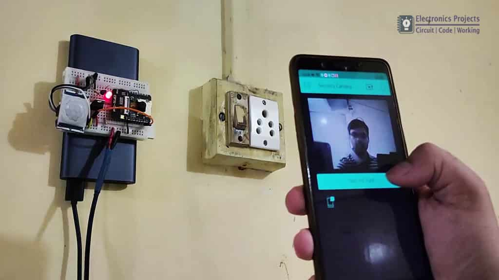
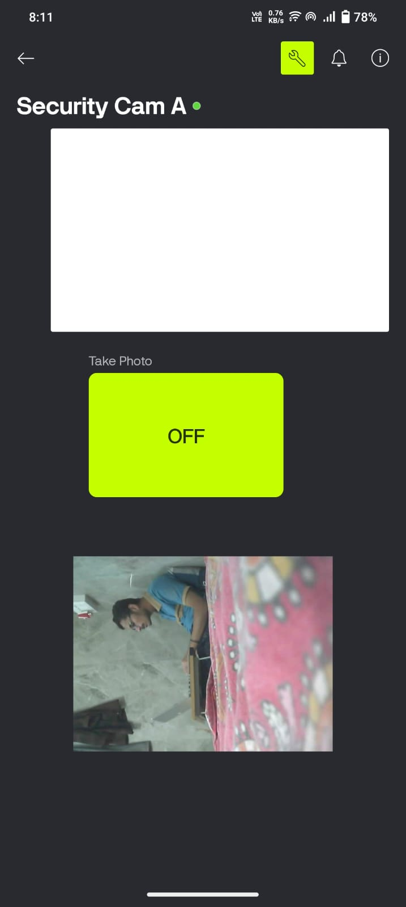
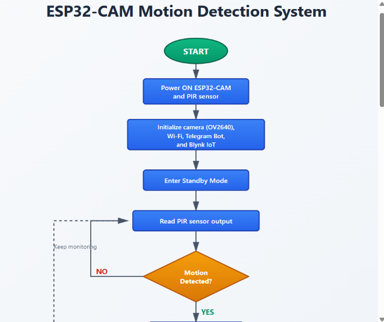

# Output and Results

This page shows the expected working output of the ESP32-CAM security surveillance system.

## Serial Monitor Output

After upload and reset, the Arduino Serial Monitor at `115200` baud should show output similar to this:

```text
Connecting to WiFi...
WiFi connected
Capture: http://192.168.1.25/capture
Stream: http://192.168.1.25:81/stream
Setup complete
PIR triggered. Validating motion.
Motion variance 238.42 is valid
Valid motion detected. Capturing photo.
Telegram photo request sent
Capture URL: http://192.168.1.25/capture?_cb=548219
```

The IP address changes depending on the local Wi-Fi network.

## Hardware Demo

The ESP32-CAM captures a photo after PIR motion detection and sends the result to the connected phone dashboard.



## Blynk Dashboard Output

The Blynk dashboard displays the stream/capture image widget and can trigger manual capture through virtual pin `V1`.



## Telegram Alert Output

When motion is confirmed, the Telegram bot sends the captured photo to the configured chat ID.


## System Workflow



## Circuit Diagrams

PIR motion sensor connection with ESP32-CAM:


Programming connection using FTDI USB-to-serial adapter:


