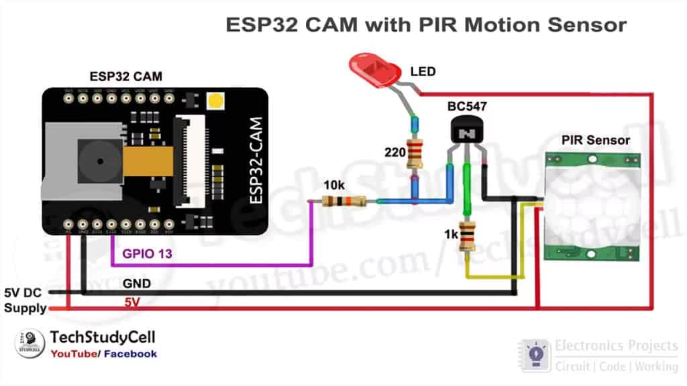
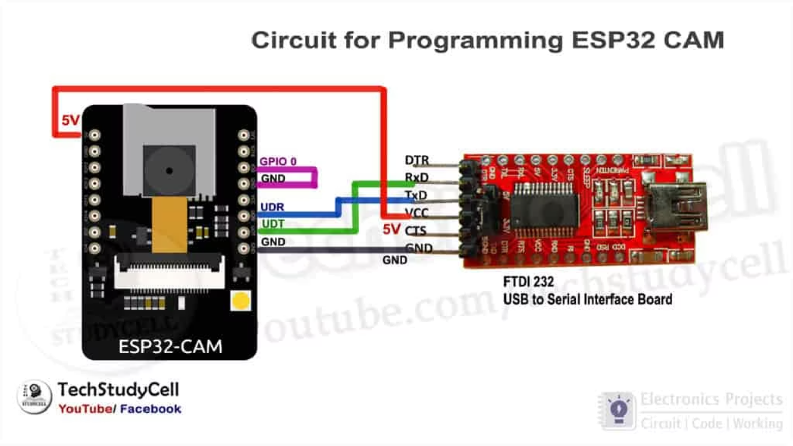

# Setup Guide

## Arduino IDE

Install the following before uploading:

- Arduino IDE
- ESP32 board support package
- Blynk Arduino library

In Arduino IDE, select the AI Thinker ESP32-CAM board. If that board option is not available, install or update the ESP32 package from Boards Manager.

## Configure Credentials

Copy the example secrets file:

```text
src/security_surveillance/secrets.example.h
```

to:

```text
src/security_surveillance/secrets.h
```

Then fill in:

- `BLYNK_TEMPLATE_ID`
- `BLYNK_TEMPLATE_NAME`
- `BLYNK_AUTH_TOKEN`
- `WIFI_SSID`
- `WIFI_PASSWORD`
- `TELEGRAM_BOT_TOKEN`
- `TELEGRAM_CHAT_ID`

`secrets.h` is ignored by Git so private credentials do not get pushed.

## Telegram Bot

1. Open Telegram and start a chat with BotFather.
2. Create a bot and copy the bot token.
3. Send any message to the bot from the target Telegram account.
4. Get the chat ID using Telegram bot API tools or a chat ID helper bot.
5. Add the bot token and chat ID to `secrets.h`.

## Blynk

Create a Blynk template and add:

| Virtual Pin | Widget |
| --- | --- |
| V0 | Image or URL display for stream URL |
| V1 | Button for manual capture |
| V2 | Image or URL display for latest capture URL |

Create an event named `motion_detected` if notification logging is required.

## Wiring

| Connection | Notes |
| --- | --- |
| PIR OUT to GPIO13 | Motion trigger input |
| PIR VCC to 5V | Use stable 5V power |
| PIR GND to GND | Common ground |
| GPIO4 | ESP32-CAM onboard flash LED |
| GPIO0 to GND | Only while uploading code |

PIR sensor wiring diagram:



For programming, connect the FTDI adapter:

| FTDI | ESP32-CAM |
| --- | --- |
| TX | U0R |
| RX | U0T |
| 5V | 5V |
| GND | GND |

After upload, disconnect GPIO0 from GND and reset the ESP32-CAM.

Programming wiring diagram:



## Runtime Behavior

1. ESP32-CAM connects to Wi-Fi.
2. Local capture endpoint starts at `http://device-ip/capture`.
3. Local stream endpoint starts at `http://device-ip:81/stream`.
4. Blynk receives the stream URL on V0.
5. PIR motion on GPIO13 triggers motion validation.
6. A confirmed event captures a photo, sends it to Telegram, logs a Blynk event, and updates V2.

## Troubleshooting

- If upload fails, confirm GPIO0 is connected to GND during upload.
- If the serial monitor shows camera init failure, check board selection and camera ribbon cable seating.
- If Telegram upload fails, verify Wi-Fi, bot token, chat ID, and internet access.
- If Blynk does not update, verify the auth token, template ID, and virtual pins.
- If images are dark, improve lighting or add external IR/night lighting.
